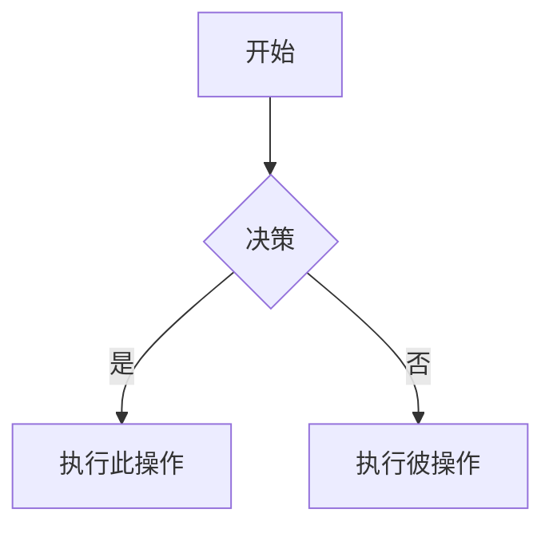

<!-- source-sha256: 7ad72e1f0a9081ed325e76b6402ad5de50a00e63e2341fd403a92f147234a007 -->
---
name: obsidian-markdown
description: 使用双向链接、嵌入、标注框、属性及其他 Obsidian 特有语法创建和编辑 Obsidian 风格 Markdown。处理 Obsidian 中的 .md 文件，或用户提及双向链接、标注框、frontmatter、标签、嵌入或 Obsidian 笔记时使用。
---

# Obsidian 风格 Markdown 技能

创建和编辑有效的 Obsidian 风格 Markdown。Obsidian 在 CommonMark 和 GFM 的基础上扩展了双向链接、嵌入、标注框、属性、注释及其他语法。本技能仅涵盖 Obsidian 特有的扩展语法——默认你已掌握标准 Markdown（标题、粗体、斜体、列表、引用、代码块、表格）。

## 工作流：创建 Obsidian 笔记

1. 在文件顶部**添加 frontmatter** 及属性（标题、标签、别名）。有关所有属性类型，请参阅 [PROPERTIES.md](references/PROPERTIES.md)。
2. 使用标准 Markdown **编写内容**和组织结构，并结合下文介绍的 Obsidian 特有语法。
3. 使用双向链接（`[[Note]]`）**链接相关笔记**，以建立仓库内部连接；外部 URL 则使用标准 Markdown 链接。
4. 使用 `![[embed]]` 语法**嵌入内容**，包括其他笔记、图片或 PDF。有关所有嵌入类型，请参阅 [EMBEDS.md](references/EMBEDS.md)。
5. 使用 `> [!type]` 语法**添加标注框**以突出显示信息。有关所有标注框类型，请参阅 [CALLOUTS.md](references/CALLOUTS.md)。
6. **验证**笔记能否在 Obsidian 阅读视图中正确渲染。

> 在双向链接和 Markdown 链接之间进行选择时：仓库内的笔记使用 `[[wikilinks]]`（Obsidian 会自动跟踪重命名），仅对外部 URL 使用 `[text](url)`。

## 内部链接（双向链接）

```markdown
[[Note Name]]                          链接到笔记
[[Note Name|Display Text]]             自定义显示文本
[[Note Name#Heading]]                  链接到标题
[[Note Name#^block-id]]                链接到块
[[#Heading in same note]]              链接到当前笔记中的标题
```

在任意段落末尾追加 `^block-id` 即可定义块 ID：

```markdown
此段落可以被链接。 ^my-block-id
```

对于列表和引用，请将块 ID 放在块后的独立行中：

```markdown
> 一个引用块

^quote-id
```

## 嵌入

在任意双向链接前添加 `!`，即可将其内容嵌入当前文档：

```markdown
![[Note Name]]                         嵌入完整笔记
![[Note Name#Heading]]                 嵌入章节
![[image.png]]                         嵌入图片
![[image.png|300]]                     以指定宽度嵌入图片
![[document.pdf#page=3]]               嵌入 PDF 页面
```

有关音频、视频、搜索结果嵌入及外部图片，请参阅 [EMBEDS.md](references/EMBEDS.md)。

## 标注框

```markdown
> [!note]
> 基础标注框。

> [!warning] 自定义标题
> 带有自定义标题的标注框。

> [!faq]- 默认折叠
> 可折叠标注框（- 表示折叠，+ 表示展开）。
```

常见类型：`note`、`tip`、`warning`、`info`、`example`、`quote`、`bug`、`danger`、`success`、`failure`、`question`、`abstract`、`todo`。

有关包含别名、嵌套和自定义 CSS 标注框的完整列表，请参阅 [CALLOUTS.md](references/CALLOUTS.md)。

## 属性（Frontmatter）

```yaml
---
title: 我的笔记
date: 2024-01-15
tags:
  - project
  - active
aliases:
  - 备选名称
cssclasses:
  - custom-class
---
```

默认属性：`tags`（可搜索的标签）、`aliases`（用于链接建议的笔记备选名称）、`cssclasses`（用于设置样式的 CSS 类）。

有关所有属性类型、标签语法规则及高级用法，请参阅 [PROPERTIES.md](references/PROPERTIES.md)。

## 标签

```markdown
#tag                    行内标签
#nested/tag             具有层级结构的嵌套标签
```

标签可以包含字母、数字（不能作为首字符）、下划线、连字符和正斜杠。也可以在 frontmatter 的 `tags` 属性下定义标签。

## 注释

```markdown
这部分可见，%%但这部分隐藏%%。

%%
整个块在阅读视图中均为隐藏状态。
%%
```

## Obsidian 特有格式

```markdown
==高亮文本==                   高亮语法
```

## 数学公式（LaTeX）

```markdown
行内：$e^{i\pi} + 1 = 0$

块级：
$$
\frac{a}{b} = c
$$
```

## 图表（Mermaid）

````markdown

````

要将 Mermaid 节点链接到 Obsidian 笔记，请添加 `class NodeName internal-link;`。

## 脚注

```markdown
带有脚注的文本[^1]。

[^1]: 脚注内容。

行内脚注。^[这是行内脚注。]
```

## 完整示例

````markdown
---
title: Alpha 项目
date: 2024-01-15
tags:
  - project
  - active
status: in-progress
---

# Alpha 项目

该项目旨在运用现代技术[[改进工作流]]。

> [!important] 关键截止日期
> 第一个里程碑的截止日期是 ==1 月 30 日==。

## 任务

- [x] 初步规划
- [ ] 开发阶段
  - [ ] 后端实现
  - [ ] 前端设计

## 笔记

该算法使用 $O(n \log n)$ 排序。详情请参阅[[算法笔记#排序]]。

![[Architecture Diagram.png|600]]

已在[[会议记录 2024-01-10#决策]]中审核。
````

## 参考资料

- [Obsidian 风格 Markdown](https://help.obsidian.md/obsidian-flavored-markdown)
- [内部链接](https://help.obsidian.md/links)
- [嵌入文件](https://help.obsidian.md/embeds)
- [标注框](https://help.obsidian.md/callouts)
- [属性](https://help.obsidian.md/properties)
